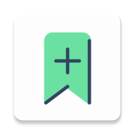

# LinkArena — Android

<p align="center">
  
</p>

<p align="center">
  <strong>Save, organize, and sync your bookmarks — beautifully.</strong>
</p>

<p align="center">
  <a href="https://kotlinlang.org/"></a>
  <a href="https://developer.android.com/jetpack/compose"></a>
  <a href="https://m3.material.io/"></a>
  <a href="https://developer.android.com/training/dependency-injection/hilt-android"></a>
  <a href="https://developer.android.com/training/data-storage/room"></a>
  
  
</p>

---

LinkArena is a native Android app for saving, organizing, and managing bookmarks. It supports group-based organization, full-text search, automatic URL metadata fetching, and sync with the LinkArena web platform.

**Web app:** [sayeedjoy/linkarena](https://github.com/sayeedjoy/linkarena)

---

## Features

- **Authentication** — Email/password login and signup with secure session management
- **Bookmark management** — Create, edit, delete, and view bookmarks with rich metadata (title, description, favicon)
- **Group organization** — Organize bookmarks into named groups for quick access
- **Search** — Full-text search across all saved bookmarks
- **Auto metadata fetch** — Automatically retrieves title, description, and favicon when adding a URL
- **Share to save** — Share any link from a browser or app directly into LinkArena; URL is prefilled and metadata is fetched instantly
- **Theme support** — System, Light, and Dark modes via Material 3 dynamic theming
- **Offline-first** — Local Room database keeps your data available without a connection

---

## Screenshots

> _Coming soon_

---

## Tech Stack

| Layer | Technology |
|---|---|
| Language | Kotlin 2.2.10 |
| UI | Jetpack Compose + Material 3 |
| Architecture | Clean Architecture + MVVM |
| Dependency Injection | Hilt 2.59.2 |
| Networking | Retrofit 2.10.0 + OkHttp 4.12.0 + Kotlinx Serialization |
| Local Storage | Room 2.7.2 |
| Preferences | DataStore |
| Navigation | Navigation Compose 2.7.6 |
| Image Loading | Coil 2.5.0 |
| Theming | Material Kolor 4.1.1 |

---

## Architecture

LinkArena follows **Clean Architecture** with an **MVVM** presentation layer, keeping concerns well-separated and testable.

```
app/src/main/java/com/sayeedjoy/linkarena/
├── data/
│   ├── local/
│   │   ├── db/              # Room database, DAOs, entities
│   │   └── datastore/       # DataStore preferences
│   ├── remote/
│   │   ├── api/             # Retrofit API interface
│   │   ├── auth/            # Auth interceptor
│   │   └── dto/             # Data transfer objects
│   └── repository/          # Repository implementations
├── di/                      # Hilt modules
├── domain/
│   ├── model/               # Domain models
│   ├── repository/          # Repository interfaces
│   └── usecase/             # Business logic use cases
└── ui/
    ├── auth/                # Login, Signup, ForgotPassword
    ├── bookmark/            # Add/Edit/Detail screens + ViewModels
    ├── groups/              # Groups management
    ├── home/                # Home feed
    ├── settings/            # App settings
    ├── components/          # Shared Compose components
    ├── navigation/          # Route definitions + NavGraphs
    └── theme/               # Color, typography, theme
```

---

## Getting Started

### Requirements

- Android Studio (latest stable)
- Android SDK with API level 36

### Setup & Build

1. Clone or download the repository and open it in Android Studio.
2. Android Studio will detect the Gradle project and prompt you to sync — click **Sync Now**.
3. Ensure `local.properties` contains a valid `sdk.dir` pointing to your Android SDK (Android Studio sets this automatically).
4. Once sync completes, select the **app** run configuration from the toolbar.
5. Click **Run** (or press `Shift + F10`) to build and deploy to an emulator or physical device.

---

## Share-to-Save Flow

1. Open any app (browser, social media, etc.) and tap **Share** on a link.
2. Select **LinkArena** from the share sheet.
3. The Add Bookmark screen opens with the URL prefilled.
4. Metadata (title, description, favicon) is fetched automatically.
5. Tap **Add Bookmark** to save.

> If you are not logged in, LinkArena holds the shared URL and resumes the flow after authentication completes.

---

## Contributing

Contributions are welcome. Please open an issue before submitting a pull request for significant changes.

---

## License

This project is not yet licensed. All rights reserved by the author.
